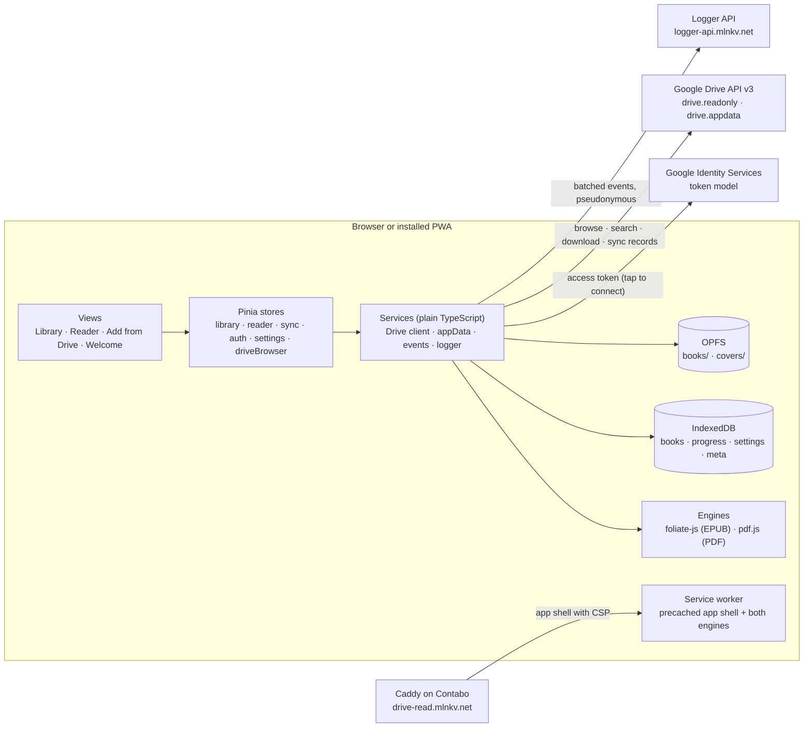
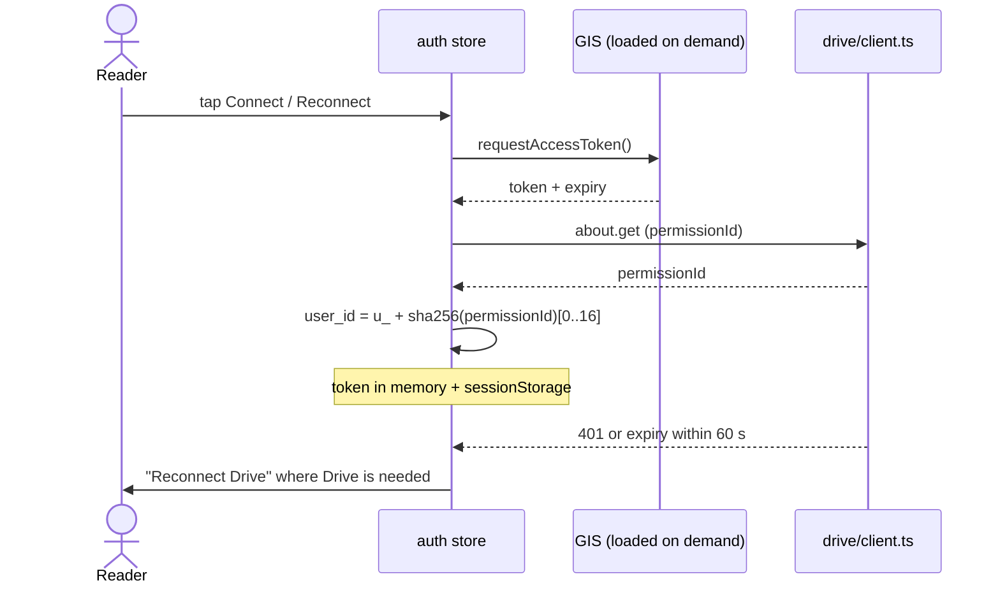
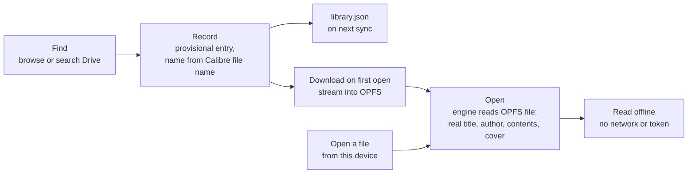
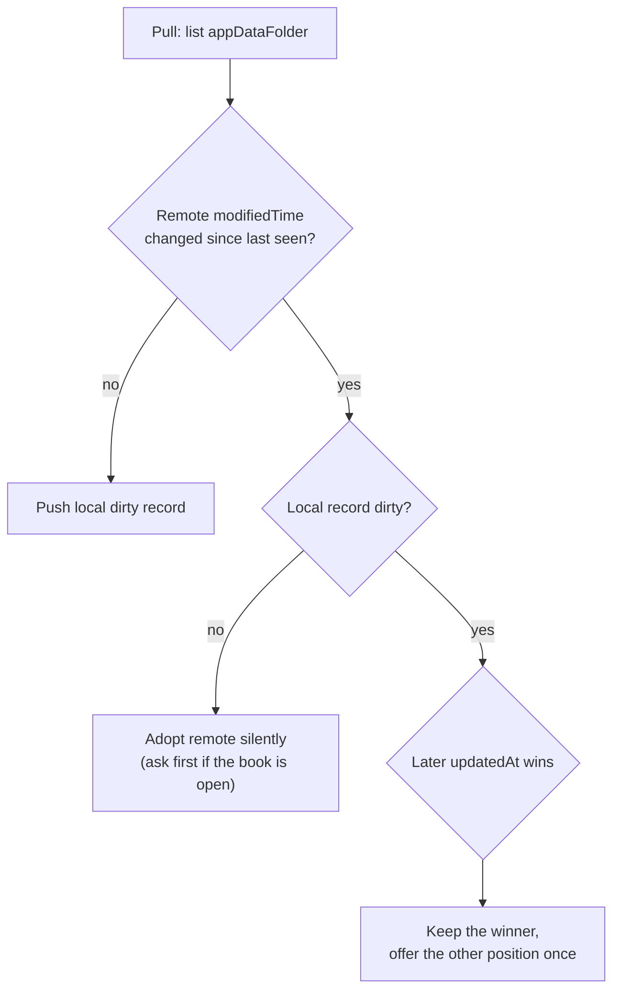
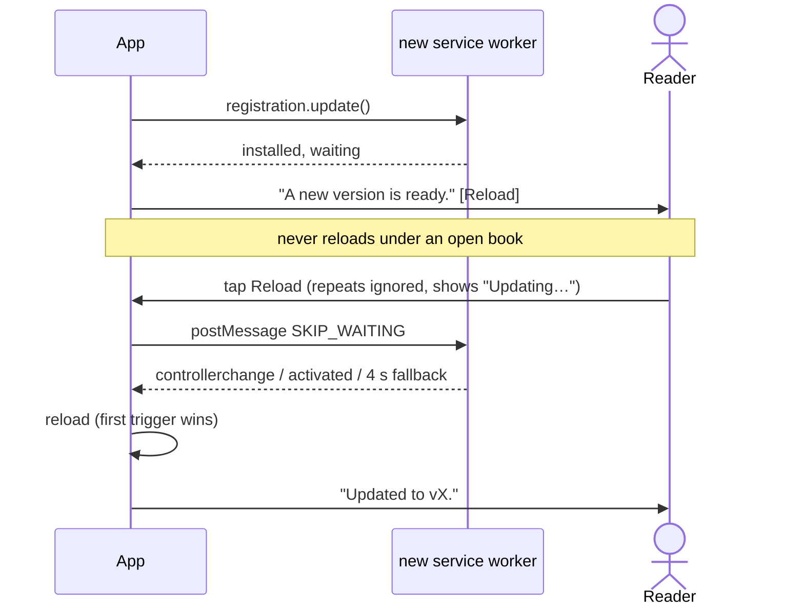
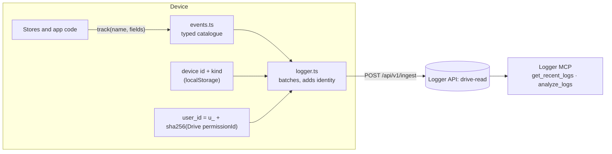
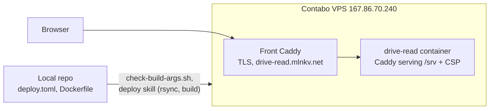

# Drive Read: Architecture

As built at v0.8.2 (October 2026). A static, client-only PWA that reads EPUB and PDF files from
the reader's Google Drive, keeps them on the device for offline reading, and syncs the reading
position through Drive. There is no backend: Google is the only remote party besides the log
collector.

Live at https://drive-read.mlnkv.net. Related docs: [`OBSERVABILITY.md`](../OBSERVABILITY.md)
(event catalogue), [`implementation-notes.md`](../implementation-notes.md) (deviations and
edge cases), [`CHANGELOG.md`](../CHANGELOG.md). `docs/Ebook Reader UI.html` is the original
design canvas export from before the build; the Drive screens have changed since (folders first,
no "All books" tab).

## Goals and limits

- An opened book stays readable with no network and no valid token.
- The reading position follows the reader across devices.
- Keyboard-first on desktop, touch on phone, light and dark themes.
- Few dependencies; native browser APIs where they exist.

Not in scope: files with DRM, highlights and notes (the sync record leaves room for them),
formats beyond EPUB and PDF, storage providers other than Google Drive.

| Constraint | Consequence |
| --- | --- |
| Browser-only OAuth gives short-lived access tokens and no refresh token | Sync tolerates an expired token; reading never depends on one |
| Book content renders in an isolated frame | App CSS does not reach it; themes are injected into the renderer |
| Browser storage is per origin and can be evicted | Local data is a cache that can be rebuilt from Drive; the app asks for persistent storage |
| Reflowable text has no fixed pages | EPUB position is a content pointer (CFI), not a page number |

## System context



Views call stores, and stores call services. Only services talk to the outside. Book files and
records stay in browser storage. The host only delivers the app shell, which the service worker
keeps for offline starts.

## Module structure

Four layers, each importing only from the one below: views, stores, services, engines. Services
are plain TypeScript with no Vue imports, so they are tested without a DOM. All services are
reached through `useServices()` (`src/services/index.ts`), which tests replace with fakes
(`src/stores/test-services.ts`).

```text
src/
  app/          main.ts, router.ts (/, /welcome, /drive, /read/:id), App.vue, keymap.ts,
                update.ts (PWA updates), install.ts, observability.ts, identity.ts,
                device.ts, wakeLock.ts, syncTriggers.ts, useOnline.ts, useImportFiles.ts, copy.ts
  domain/       book.ts, settings.ts, reading.ts          pure types and rules
  views/        LibraryView, ReaderView, DriveView, ConnectView
  components/   BookCard, BookRow, BookCover, ContinueRow, ProgressSegments, ContentsPanel,
                TextSettings, SegmentedControl, AppNotice, UpdateToast, AppIcon
  stores/       auth, library, reader, sync, settings, driveBrowser
  services/
    auth/       gis.ts           token client, script loaded on first use
    drive/      client.ts        Drive API: browse, search, download, about; typed DriveError
                appdata.ts       library.json and progress-<fileId>.json
                names.ts         titles and authors from Calibre file and folder names
    engine/     types.ts         BookEngine interface
                epub.ts          foliate-js adapter (epub-meta.ts: title, author, cover)
                pdf.ts           pdf.js adapter (pdf-layout.ts: layout maths)
                progress.ts      chapter and progress maths
    storage/    db.ts            IndexedDB (raw, via idb.ts): books, progress, settings, meta
                blobs.ts         OPFS reads; writes through blobs.worker.ts
                hash.ts          content hash for local files
                persist.ts       storage.persist() and usage
    sync/       merge.ts         conflict rule and library merge
    events.ts                    typed event catalogue (OBSERVABILITY.md)
    logger.ts                    Logger API client, batching, identity
  shared/       result.ts        Result / Option
  styles/       tokens.css, reader-theme.ts, fonts.ts
vendor/foliate-js/               git submodule, pinned commit
csp.ts                           the one CSP: vite preview, e2e, container Caddy
scripts/                         caddyfile.ts, icons.ts, check-build-args.sh
e2e/                             Playwright specs + fake-google.ts + fixture builders
```

| Layer | Owns | Does not |
| --- | --- | --- |
| Views and components | Layout, input, the keymap | Call `fetch` or touch storage |
| Stores (Pinia) | App state and orchestration | Touch the DOM |
| Services | All IO: Drive, auth, IndexedDB, OPFS, logs | Hold UI state |
| Engines | Parsing, pagination, rendering inside their own frame | Know about Drive or stores |

Both formats sit behind one interface, so the reader view and sync never branch on format:

```ts
interface BookEngine {
  open(file: File): Promise<Result<BookMeta, OpenError>>
  mount(el: HTMLElement, at?: Restore): Promise<void>
  next(): Promise<void>
  prev(): Promise<void>
  goTo(loc: Locator): Promise<void>
  setTheme(theme: ReaderTheme): void
  onRelocate(cb: (r: Relocation) => void): void
  onKeydown(cb: (e: KeyboardEvent) => void): void   // keys pressed inside the book frame
  destroy(): void
}

type Locator =
  | { kind: 'cfi'; cfi: string }
  | { kind: 'page'; page: number; offset: number }   // PDF: page + offset down it
  | { kind: 'href'; href: string }                   // contents links, never stored

interface Restore { locator: Locator; fraction: number }   // fraction is the fallback

interface Position {
  locator: Locator
  fraction: number         // 0..1 through the book
  chapterIndex: number
  chapterFraction: number  // 0..1 through the chapter
}

interface Relocation {
  position: Position
  chapterMinutesLeft: number | null
  page?: { current: number; total: number }   // PDF
}

interface BookMeta {
  title: string
  author: string
  cover?: Blob
  toc: { label: string; locator: Locator; start: number }[]
}
```

`toc[].start` is each chapter's starting fraction; the segmented progress bar and the contents
panel both draw from it.

## Data model and storage

Local storage is the source of truth for the UI; Drive holds only what must reach other
devices. The Drive file ID is a book's key everywhere.

| Where | What | Key | Leaves the device |
| --- | --- | --- | --- |
| IndexedDB `books` | Title, author, format, size, md5, contents, download state, `provisional` until first opened, opened time | Drive file ID, or `local-<sha256>` | Via `library.json`, Drive books only |
| IndexedDB `progress` | Locator, fraction, updatedAt, device, dirty flag, Drive record ID and the `modifiedTime` last seen | book ID | Yes, Drive books only |
| IndexedDB `settings` | Theme, typeface, size, line spacing, margins, alignment, library view | fixed key | No |
| IndexedDB `meta` (v2) | `library.json` entries as last merged, last sync time | fixed key | No |
| localStorage | Theme mirror, device ID and kind, hashed user ID, last version run | fixed keys | Device and user ID only, as log fields |
| sessionStorage | Access token and expiry | fixed key | No |
| OPFS `/books/<id>` | The book file as downloaded | path | No (Drive already has it) |
| OPFS `/covers/<id>` | Cover image from the first open | path | No |
| Drive appDataFolder | `library.json` and `progress-<fileId>.json` | file name | n/a |

**Progress record** (`progress-<fileId>.json`; locally the same plus `dirty`, `remoteId`, `remoteModifiedTime`):

```json
{
  "v": 1,
  "fileId": "1AbC...",
  "locator": { "kind": "cfi", "cfi": "epubcfi(/6/14!/4/2/18/1:132)" },
  "fraction": 0.42,
  "updatedAt": "2026-10-04T15:12:09Z",
  "device": { "id": "k3f9", "name": "Laptop" },
  "bookmarks": []
}
```

**Library record** (`library.json`): `{ v: 1, entries: [{ fileId, md5, name, addedAt, updatedAt, removed }] }`.
Removal sets `removed: true` instead of deleting the entry, so another device does not add the
book back on merge.

- md5 comes from Drive's file metadata and is stored, for detecting a replaced file (planned).
- Local books are keyed `local-` + the first 32 hex digits of SHA-256 (Web Crypto has no MD5) and
  never leave the device.
- OPFS writes go through a worker using a sync access handle; a failed write removes the partial
  file.
- Once books are added the app calls `navigator.storage.persist()` and logs the answer with
  usage; the library footer shows the space used. Books the browser evicted go back to
  "Drive only" at start.
- Every record carries `v`. IndexedDB v2 added the `meta` store; the migration is tested.
- Store objects are written with `toRaw`: IndexedDB cannot clone a reactive proxy.

## Auth and Drive access

Sign-in uses the Google Identity Services **token model**: no backend, no refresh token. The
app asks for an access token on a tap, keeps it in memory and sessionStorage until it expires
(about an hour), and asks again with one tap when Drive is next needed. Books on the device
keep working without a token.

| Scope | Why | Google's class |
| --- | --- | --- |
| `drive.readonly` | Browse folders, search and download books anywhere in the reader's Drive | Restricted |
| `drive.appdata` | Library and progress records in the hidden app folder | Non-sensitive |

There is no Google Picker and no API key (owner decision), so `drive.file` is not enough:
browsing the reader's own folders needs `drive.readonly`. While the OAuth app is in testing mode
with listed test users, the restricted scope needs no verification.



- The GIS script loads on the first tap that needs Drive, never at boot, so the app starts with
  no network.
- A token within a minute of expiry counts as gone. Each lapse is logged as `auth.expired` with
  where it was found.
- Every call goes through `drive/client.ts` (plain `fetch`, no `gapi`), which turns HTTP results
  into a typed `DriveError`: `auth-expired`, `offline`, `not-found`, `forbidden`, `rate-limited`,
  `http`.

| Call | Used for |
| --- | --- |
| `files.list` with `'<folder>' in parents` | Browse a folder: folders first, then books, alphabetical |
| `files.list` with `name contains` | Search by name across Drive (EPUB and PDF only) |
| `files.get?alt=media` | Download a book, streamed with progress |
| `about.get?fields=user(permissionId)` | Pseudonymous user id for the logs |
| `files.list` / `create` / `update` in `appDataFolder` | `library.json` and `progress-<fileId>.json` |

## Book pipeline



1. **Find.** The reader browses folders or searches in the Drive screen. Adding a book or a
   whole folder saves provisional records right away.
2. **Record.** Records join `library.json` on the next sync, so other devices list them as
   "Drive only".
3. **Download.** On first open the file streams from Drive into OPFS with a progress bar. A
   failure leaves no partial file.
4. **Open.** The engine reads the stored file. On first open the real title, author, contents
   and cover replace the provisional ones.
5. **Read offline.** From then on the book opens without network or token.

| Format | Engine | Notes |
| --- | --- | --- |
| EPUB | foliate-js (git submodule, pinned commit) | Paginated, reader themes and typefaces, CFI positions; book scripts blocked by CSP |
| PDF | pdfjs-dist 6 | Pages fitted to width and scrolled; zoom 100–300% (buttons, `+` `-` `0`, pinch); a text layer makes text selectable; standard fonts, CMaps, ICC profiles and WebAssembly image decoders (JPEG 2000, JBIG2) served from `/pdfjs/`; position is page + offset |

Local books (opened from the device) go straight to OPFS, keyed by a content hash. They stay on
that device: they are not in `library.json` and their progress does not sync.

## Progress sync

Progress is written locally on every page turn and pushed to Drive when the reader pauses.
Nothing polls: sync runs only on the triggers below (`src/app/syncTriggers.ts`, `stores/sync.ts`).

| Trigger | Action |
| --- | --- |
| Page turn | Write `progress` to IndexedDB, mark it dirty, restart a 20 s idle timer |
| Idle timer fires | Push dirty records |
| Tab hidden | Push now with `fetch` `keepalive` |
| App start (connected), back online, (re)connected, tab becomes visible | Pull, then push |
| Book opened | Pull that book's record |



- A conflict exists only when the remote record changed since this device last saw it (Drive
  `modifiedTime`, a server clock) **and** the local record is dirty. The later `updatedAt` wins;
  the other position is offered once in the reader.
- Latest write wins, not furthest position: flipping back to re-read must not be undone by sync.
- Progress is saved only on true page turns or explicit navigations; initial mount/restore and layout reports (resize, orientation changes) do not mark records dirty or bump timestamps.
- A push that fails (offline, expired token, rate limit) leaves the record dirty; the next
  trigger retries. `sync.failed` logs the reason and the backlog.
- `library.json` merges per entry by `updatedAt`, with removal markers.
- Passes run under a `navigator.locks` lock, so two tabs never sync at once.

## Offline, service worker and updates

The service worker caches only the app shell; books and sync records never pass through it.

| What | Where | Strategy |
| --- | --- | --- |
| HTML, JS, CSS, fonts, icons | Cache Storage, Workbox precache | Precached, versioned by build hash |
| Engine chunks (foliate-js, pdf.js and its worker) | Cache Storage | Precached, so both formats open offline |
| pdf.js data: standard fonts, ICC profiles, WebAssembly decoders | Cache Storage | Precached (`scripts/pdfjs-assets.ts` emits them to `/pdfjs/`) |
| pdf.js CMaps (CJK text, 1.6 MB) | Cache Storage | Cached on first use |
| Book files and covers | OPFS | Written by the app |
| Drive API responses | Not cached | Network only |
| Google Identity script | Not cached | Loaded on demand |

**Updates** (`src/app/update.ts`, vite-plugin-pwa in prompt mode): the app checks for a new
service worker at start, when it becomes visible, when it comes back online and every hour.



Each step is logged: `pwa.update_available` → `pwa.update_applied` → `pwa.reloading` (with the
trigger) → `pwa.updated`. If no worker is waiting (the update already took over), the tap
reloads at once.

**Manifest:** `display: standalone`, theme colours per scheme, `file_handlers` for `.epub` and
`.pdf` where supported. **Wake lock** keeps the screen on while reading and is released after
5 minutes without a page turn.

## Theming

One set of semantic tokens (`src/styles/tokens.css`, Tailwind 4 `@theme`) drives both the app
chrome and the book content; dark mode swaps token values.

| Token | Light | Dark | Use |
| --- | --- | --- | --- |
| `paper` | `#F3F0E8` | `#171614` | Ground |
| `panel` | `#E9E5DA` | `#1F1E1B` | Side panels, notices |
| `ink` | `#1C1B19` | `#E6E2D8` | Text, selected controls |
| `ink2` | `#5C5850` | `#A39E92` | Secondary text |
| `rule` | `#CCC6B8` | `#383630` | Hairlines |
| `track` | `#ADA695` | `#565248` | Unread part of a progress bar |
| `signal` | `#D9480F` | `#F0672A` | Reading progress, nothing else |

- The setting is `system`, `light` or `dark`. `public/theme-init.js` (an external file, so the
  CSP needs no inline script) sets `data-theme` before first paint from a localStorage mirror.
- `styles/reader-theme.ts` combines token values with the text settings into CSS that
  `engine.setTheme()` injects into the book frame. "Original" typeface injects no font override.
- PDF pages keep their own colours; dark mode changes only the surround.
- Space Grotesk, IBM Plex Mono, Literata, Cartisse, Libron, NV Jost, NV Zilla Slab, and Readerly are self-hosted fonts, precached.

## Failure states

No failure blocks reading a book already on the device. Each shows one notice or row state.

| Situation | Detected by | The reader sees | Recovery |
| --- | --- | --- | --- |
| Token expired | 401 or passed expiry | "Reconnect Drive" where Drive is needed | Tap Reconnect |
| Sign-in popup blocked or closed | GIS error callback | Inline message on the button | Allow popups, tap again |
| Offline | `offline` event or a failed fetch | Notice with positions waiting | Automatic on `online` |
| Book not downloaded while offline | `downloaded: false` | Row "Drive only", open explains | Opens once online |
| Download interrupted | Stream error | Error with Try again; partial file removed | Tap Try again |
| File deleted or access lost in Drive | Daily Drive check (below), or 404 / 403 on download | "Missing in Drive" on the row; a downloaded copy still opens | Remove the book |
| File replaced in Drive | Daily Drive check: md5 differs from the downloaded file | "New version" on the row; the reader offers "Get it" | Old file removed, new one downloaded; position falls back to `fraction` if the CFI no longer resolves |
| Protected or damaged file | `engine.open` fails | "This file can't be opened…" | None |
| Storage full | `QuotaExceededError` | "Not enough space" with **Free space** | Opens the library's Downloaded view (`/?show=downloaded`): Drive books on the device, largest first; "Remove download" frees the file and keeps the book and place |
| Storage evicted by the browser | Record says downloaded, OPFS file missing | Row back to "Drive only" | Downloads again on open |

Each state is covered by end-to-end tests against a fake Google (`e2e/fake-google.ts`).

**Daily Drive check** (`services/sync/driveCheck.ts`, run by `stores/sync.ts` after a full sync,
at most once a day and only with a valid token): one paged `files.list` of every EPUB and PDF in
Drive (the search query with no name) is compared with the library's Drive books. A book the
listing lacks is marked missing; one listed again is cleared; a downloaded book whose md5
changed gets a `driveVersion` offer; a book not downloaded just takes the new md5 and size. A
listing that reaches the 5000-file cap may be cut short, so then nothing is marked missing. A
failed check never fails the sync. fast-check properties pin this down: one pass settles (a
second changes nothing), local books are never touched, and after a complete pass "missing"
means exactly "not listed".

## Observability

Named events with measurements go to Logger API (project `drive-read`, 7-day retention). The
catalogue is typed in `src/services/events.ts`; [`OBSERVABILITY.md`](../OBSERVABILITY.md) lists
every event and field.



- **Identity:** a random device id with its kind and, once connected, a hashed user id. Never an
  email, name, title, file name or token.
- **Levels:** names ending in `failed` or `expired` log as warn; `error.*` as error.
- **Tests never send:** the ingest key is blank under test; each store's tests assert its events.
- **Reading time** counts gaps between page turns, each capped at 5 minutes; layout changes are
  not page turns.

## Deployment



- Static build in a Caddy container behind the server's front Caddy. DNS: an A record for
  `drive-read` at Namecheap.
- `deploy.toml` and Docker build args are the source of truth for build-time values (the ingest
  key is a placeholder there, filled from the local `.env`). `scripts/check-build-args.sh`
  compares them with the server before each deploy. `.env` never enters the build context.
- Every deploy is checked by loading the live bundle and seeing `app.started` with the new
  version in the logs.
- The container Caddyfile is generated from `csp.ts` (`scripts/caddyfile.ts`), so vite preview,
  the e2e tests and production send the same CSP. `/assets/*` is `immutable` for a year;
  everything else (`index.html`, `sw.js`, manifest) is `no-cache`.

```text
default-src 'self';
script-src 'self' 'wasm-unsafe-eval' https://accounts.google.com;
connect-src 'self' https://www.googleapis.com https://accounts.google.com https://logger-api.mlnkv.net;
frame-src blob: https://accounts.google.com;
img-src 'self' blob: data:;
style-src 'self' 'unsafe-inline' blob:;
font-src 'self' blob: data:;
worker-src 'self' blob:
```

`script-src` allows neither `blob:` nor `'unsafe-inline'`, so a script inside a book cannot run.
`'wasm-unsafe-eval'` only lets pdf.js compile its own WebAssembly decoders, served from `'self'`;
it allows no JavaScript eval. foliate-js's own PDF path (with a second, vendored pdf.js) is
replaced by a stub at build time, so it is neither shipped nor precached.

**Google Cloud:** OAuth Web client with origins `http://localhost:5173` and
`https://drive-read.mlnkv.net`, no redirect URIs; Drive API enabled; no API key; consent screen
in testing mode with scopes `drive.readonly` and `drive.appdata`.

## Testing

| Layer | Tool | Covers |
| --- | --- | --- |
| Unit | Vitest 5, happy-dom, fake-indexeddb | Domain rules, services, stores (with fake services), events |
| End-to-end | Playwright, fake Google (`e2e/fake-google.ts`) | Reader, Drive browsing, sync across two devices, PDF, offline, failure states, PWA update flow |

Gates before a release: unit tests, e2e, `vue-tsc` typecheck, oxlint, `bun audit`.

## Decisions

| Decision | Chosen | Why |
| --- | --- | --- |
| Finding books | Drive API browse and search, no Picker | Owner decision; browsing whole folders |
| Scopes | `drive.readonly` + `drive.appdata` | Browsing needs read access beyond `drive.file` |
| Backend | None; one tap to reconnect | No secret, no server state |
| EPUB engine | foliate-js as a pinned git submodule | Maintained, no npm package |
| Local books | Stay on the device, no sync | Owner decision |
| Drive screen | Folders first, alphabetical, no "All books" list | Owner decision |
| Updates | Prompted, never mid-book | Never lose the reader's place |
| Log identity | Random device id + hashed Drive permission id | Measurable per user without personal data |

## Build history

1. Shell, design tokens, routing, library from local files.
2. EPUB reader: foliate-js, themes, typefaces, position.
3. PDF reader.
4. Google sign-in and Drive spike (`spikes/drive-access/`).
5. Drive browse, search, download into OPFS.
6. Sync through appDataFolder.
7. Offline and failure states.
8. PWA install and updates.
9. Hardening, observability and deployment.

Open work is tracked in Kairos (project in `kairos.id`).
